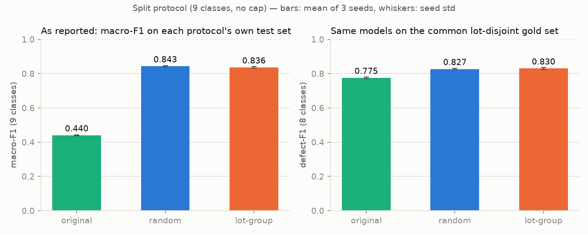
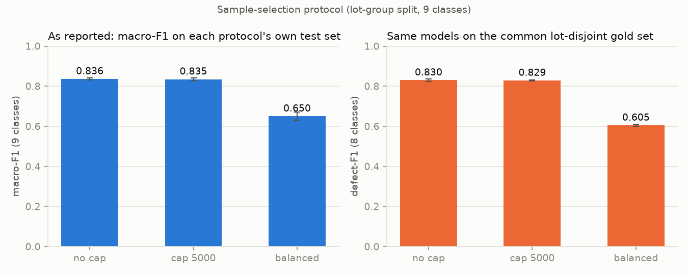
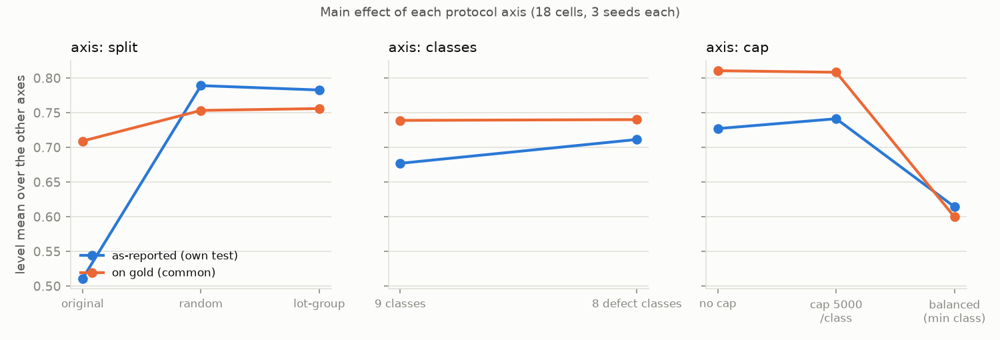
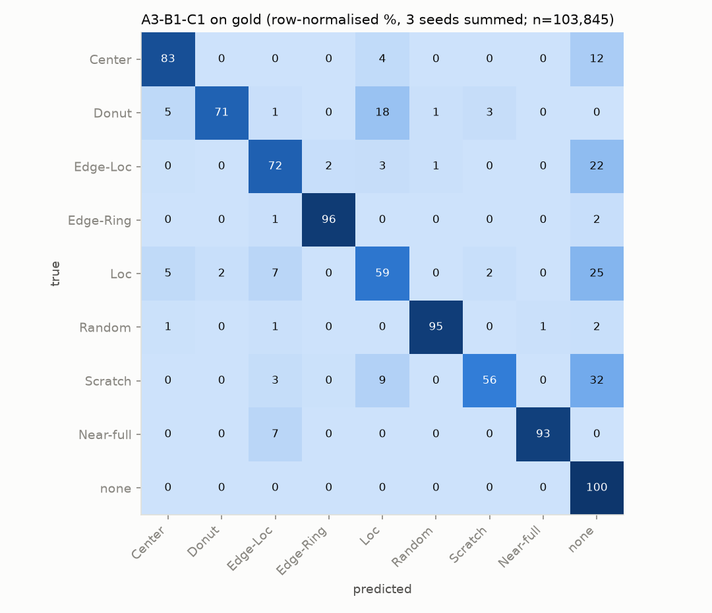
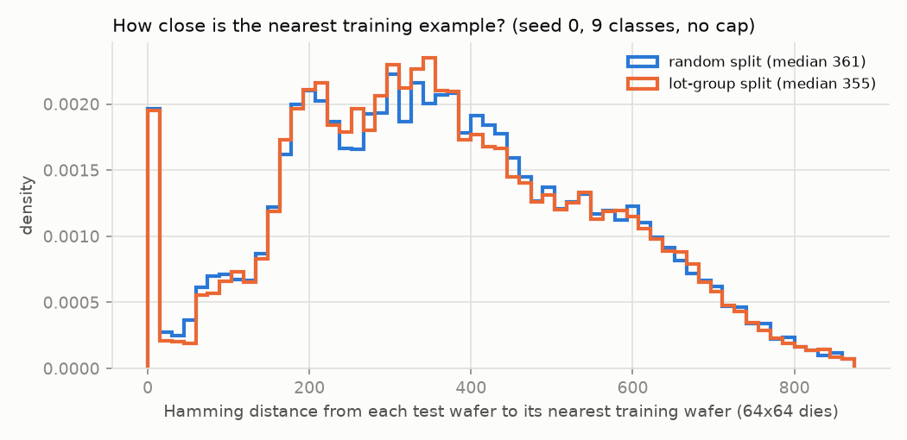
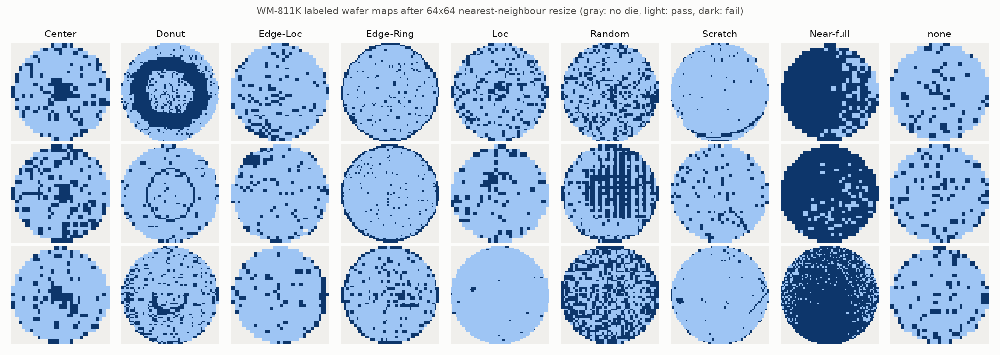

# WM-811K 평가 프로토콜 감사 (Evaluation-Protocol Audit)

모델·학습 절차·seed 집합을 전부 고정한 채, **평가 프로토콜(분할 방식 / 클래스 구성 / 표본 선택)만** 바꿔가며 보고되는 웨이퍼 결함 분류 성능이 얼마나 이동하는지 측정한 실험입니다. 측정 대상은 모델이 아니라 **프로토콜이 성능 숫자에 기여하는 크기**입니다.

> 이 문서는 결과 요약입니다. 설계 근거·진행 과정·가설이 반박된 지점·한계에 대한 자세한 설명은 [`docs/REPORT.md`](docs/REPORT.md)를 참고하세요.

> **English abstract.** WM-811K wafer-map defect classification papers report very different held-out accuracies, but they also use very different train/test protocols (original vendor split, random split, lot-disjoint split; 8 or 9 classes; capped or uncapped per-class sample counts). This project holds the model, training recipe, and random seeds fixed and varies only the evaluation protocol across 18 cells (3 seeds each), reporting every cell against both its own test set and one common lot-disjoint gold set. The representative number — lot-disjoint split, 9 classes, no cap — is **0.839 ± 0.005 gold macro-F1**. Somewhat against the project's own working hypothesis, lot-leakage from a random split moves the score by +0.007 (paired over 3 seeds, sign-consistent in all three but within 2× the seed noise of the two cells actually compared, ≈0.004) — at n=3 this bounds the leakage effect at roughly ≤0.01 rather than distinguishing it from zero; per-class sample-count capping moves it by up to −0.225, an order of magnitude larger and well outside that noise band. The original vendor split is shown to be a materially different protocol — **≈0.44 vs 0.659 9-class macro-F1** for the identical model on a common lot-disjoint test set (0.775 if the metric is narrowed to defect-F1 over the 8 defect classes only; the ≈0.44 own-test figure itself swings by roughly ±0.05 between logged checkpoints of the same run — see below) — which is the clearest demonstration of the project's point: the same model reads as ≈0.44 or 0.66 macro-F1 (or 0.78 under a quietly narrower metric) depending purely on which test set, and which metric, is reported.

## 핵심 결과 (숫자 먼저, 조건은 그다음)

1. **0.839 ± 0.005** — 가장 엄격한 조건(`A3-B1-C1`: lot-group 분할, 9 클래스, cap 없음)에서 공통 gold 테스트셋에 대한 9-class macro-F1 (3 seed 평균 ± 표준편차). 배포 상황에 가장 가까운 대표값입니다.
2. 같은 모델·같은 학습으로 **분할만 랜덤(lot 혼입 허용)으로 바꾼 조건(`A2-B1-C1`)**의 as-reported macro-F1은 **0.843**, lot-group 분할(`A3-B1-C1`)의 as-reported macro-F1은 **0.836**입니다.
3. 격차는 **+0.007**(3 seed 페어드 평균, sd 0.003; 부호는 +0.0105/+0.0052/+0.0051로 세 seed 모두 일관)입니다. 표 전체 평균 seed std(0.0112)는 이 비교와 무관한 C3 등 노이즈가 큰 셀들에 좌우된 값이라 이 격차의 기준으로 쓸 수 없습니다 — 실제로 비교되는 두 셀(`A2-B1-C1`, `A3-B1-C1`)만의 seed std는 각각 0.004로, 격차(0.007)는 그 2배(0.0086) 안쪽입니다. 계획서 §5 규칙(격차 < 2·std ⇒ 노이즈와 구분 불가)은 이 기준으로도 여전히 성립하지만, 정확히는 **"0이다"가 아니라 "n=3에서는 누수 효과를 대략 ≤0.01로만 상한 지을 수 있다"**는 뜻입니다. (반면 클래스당 표본 수를 줄이는 조작은 최대 −0.225까지 움직입니다 — 아래 "핵심 비교" 참고.)

## 왜 이 실험인가

실제 배포 상황에서는 학습 시점에 보지 못한 **새 lot**의 웨이퍼를 판정해야 합니다. 그런데 WM-811K를 쓰는 공개 프로젝트들은 검증 방식이 서로 다릅니다.

- [arXiv:2605.14255](https://arxiv.org/abs/2605.14255) — lot 단위 분할을 채택하지만, lot을 섞는 분할과 비교한 격차는 측정하지 않습니다.
- [github.com/judahobi/Defect_KAN](https://github.com/judahobi/Defect_KAN) — 층화 70/15/15 분할을 쓰고, `None` 클래스를 15,000장으로 캡핑합니다.
- [github.com/fr407041/WM-811K_semiconductor_wafer_map_pattern_classified](https://github.com/fr407041/WM-811K_semiconductor_wafer_map_pattern_classified) — 결함 클래스만 25,519장을 추려 랜덤 60/15/25로 나눕니다.

세 저장소 모두 합리적인 선택이지만 서로 다른 프로토콜이고, 그래서 보고되는 숫자를 직접 비교할 수 없습니다. 이 프로젝트는 어느 쪽이 맞다고 주장하는 대신, **평가 프로토콜이 성능에 미치는 영향**을 같은 모델·같은 학습량으로 직접 재보고, 제 숫자는 어떤 조건에서 나온 것인지 함께 제시합니다.

## 프로토콜 카드

| 항목 | 값 |
|---|---|
| 데이터 원천 | MIR 공식 배포본(`http://mirlab.org/dataSet/public/MIR-WM811K.zip`)의 `WM811K.pkl`. 라벨된 웨이퍼 172,950장 |
| Gold 테스트셋 | `StratifiedGroupKFold(n_splits=5, shuffle=True, random_state=20260825)`, `y=label9`, `groups=lot_id`, fold 0의 test 인덱스. 34,615장 (라벨 전체의 20.01%). 어떤 셀의 학습·분할·cap 추출에도 쓰이지 않음 |
| Gold 인덱스 해시 | `sha1(np.load("data/processed/gold_indices.npy").tobytes())` 앞 12자리 = `3a6030ac2ff1` (배열 바이트 기준. 파일 전체 해시가 아님) |
| 리사이즈 | 64×64, 중심 정렬 nearest-neighbour (`floor((i+0.5)*H/64)`, 종횡비 보존 없음) |
| 입력 인코딩 | 배치 시점 GPU에서 3채널 one-hot `[B,3,64,64]` float32 (die 없음/정상/불량) |
| 모델 | `SmallCNN` — conv(3→32)-BN-ReLU-Pool → conv(32→64)-BN-ReLU-Pool → conv(64→128)-BN-ReLU-Pool → conv(128→128)-BN-ReLU → GAP → Dropout(0.3) → Linear. **242,345 파라미터** |
| 옵티마이저 | AdamW, lr 1e-3, weight_decay 1e-4, betas 기본값 |
| 스케줄 / 학습량 | cosine decay to 0, warmup 없음. **8,000 고정 gradient step**(에폭 아님), batch 256 |
| 검증셋 / early stopping / 증강 | 없음. 마지막 가중치로 평가 |
| seed | {0, 1, 2} — python/numpy/torch 시드 고정, `cudnn.benchmark=False` |
| 지표 정의 | `macro_f1 = sklearn.metrics.f1_score(average='macro')`, `balanced_accuracy = sklearn.metrics.balanced_accuracy_score`, 클래스별 F1/precision/recall, confusion matrix. Raw accuracy는 단독으로 보고하지 않음 |

## 실험 설계

세 축을 조작하고, pool(라벨 전체 − gold) 안에서만 셀을 구성합니다. 적용 순서(고정): **pool → B(클래스 필터) → C(cap, seed) → A(분할, seed) → 학습(seed) → 평가**.

- **축 A — 분할**: `A1 원본` (제공된 Training/Test 라벨 그대로) · `A2 랜덤` (StratifiedKFold 5, seed) · `A3 lot-group` (StratifiedGroupKFold 5, `groups=lot_id`, seed) · `A4 lot-순서`(보조, B1×C1 전용 — lot 번호 오름차순 정렬 후 뒤 20% lot을 test로, 유사-시간 분할 통제 조건)
- **축 B — 클래스 구성**: `B1 9클래스`(전체) · `B2 8클래스`(none 제거)
- **축 C — 클래스당 cap**: `C1 cap 없음` · `C2 cap 5,000/class` · `C3 balanced`(축 B 적용 후 pool 내 최소 클래스 수로 캡)

3×2×3 = **18개 셀**(`A{1,2,3}-B{1,2}-C{1,2,3}`) × 3 seed + 보조 `A4-B1-C1` × 3 seed = 57 run.

각 셀은 두 열로 보고합니다.

- **as-reported (own test)**: 그 셀 자신의 테스트셋·자신의 클래스 집합 기준 macro-F1 — 논문이 흔히 보고하는 숫자에 해당.
- **on-gold (common)**: 모든 셀에 공통인 gold 테스트셋 기준 defect 8클래스 F1(`gold defect-F1`), B1 셀은 추가로 9클래스 macro-F1(`gold 9-class macro-F1`)까지. 프로토콜을 제거했을 때 실제로 어느 정도인지를 보여주는 숫자.

## 결과

### 핵심 비교 ① — 분할: 랜덤 vs lot-group (9클래스, cap 없음)

| 조건 | own macro-F1 | own defect-F1 | gold defect-F1 |
|---|---:|---:|---:|
| A2 랜덤 (`A2-B1-C1`) | 0.843 ± 0.004 | 0.836 ± 0.005 | 0.827 ± 0.004 |
| A3 lot-group (`A3-B1-C1`) | 0.836 ± 0.004 | 0.829 ± 0.006 | 0.830 ± 0.006 |
| A1 원본 (`A1-B1-C1`, 참고) | 0.440 ± 0.002 | 0.550 ± 0.003 | 0.775 ± 0.004 |
| A4 lot-순서 (`A4-B1-C1`, 보조·참고) | 0.571 ± 0.026 | 0.558 ± 0.032 | 0.826 ± 0.003 |

**A1/A4 own macro-F1의 ±에 관한 참고**: 이 ±는 고정된 마지막 스텝(8,000)에서 3 seed 사이의 표준편차일 뿐입니다. 같은 run 안에서도 값은 훨씬 더 흔들립니다 — `A1-B1-C1-s0`의 마지막 네 로그 체크포인트(step 5k~8k)의 own macro-F1은 0.420 / 0.506 / 0.428 / 0.438(`results/runs/A1-B1-C1-s0/train_log.csv`)이고, step 6,000 하나만 보면 세 seed가 0.506 / 0.455 / 0.424로 흩어집니다. A1·A4의 own 테스트셋이 비층화(A1은 93% none)이기 때문입니다. 그래서 이 문서 전체에서 A1/A4의 own 수치는 소수점 셋째 자리까지의 안정된 측정값이 아니라 **≈0.44, ≈0.57** 정도로 읽는 것이 맞습니다. (반면 gold 열은 gold셋이 층화·고정이라 이 불안정성이 없습니다.)

- as-reported 격차(A2 − A3): **+0.007**(3 seed 페어드, sd 0.003; +0.0105/+0.0052/+0.0051로 부호 일관). 이 두 셀의 seed std는 각각 0.004(A2)·0.004(A3)이며 격차는 그 2배(0.0086) 안쪽입니다 — 계획서 §5 규칙대로 노이즈와 완전히 구분되지는 않지만, 부호가 3/3 일관되므로 **누수 효과를 대략 ≤0.01로 상한 지을 뿐 0이라고 단정할 수는 없습니다.**
- 모델 내부 own-gold 격차(같은 가중치, 자기 테스트셋 − gold): **A2 = +0.009, A3 = −0.001**. A3는 정의상 own ≈ gold여야 하고 실제로 거의 0 — sanity check 통과. A2도 부풀림이 매우 작음.
- 최근접 이웃 해밍 거리(A2 vs A3, `nn_hamming_A2_vs_A3.png`)의 중앙값도 거의 같습니다(랜덤 약 361, lot-group 약 355) — 테스트 웨이퍼가 학습 셋에서 얼마나 가까운 이웃을 찾는지가 두 분할에서 비슷하다는 뜻이고, 위 결과가 왜 작은지를 설명합니다.
- `lot_share_rate`(랜덤 분할 테스트 웨이퍼 중 같은 lot의 다른 웨이퍼가 학습에 있는 비율)는 0.98로 실제로는 랜덤 분할이 lot을 거의 다 공유합니다. 그럼에도 성능 격차는 작습니다.

**해석 (측정된 사실로 진술)**: 이 데이터셋·이 모델 규모에서는 lot 혼입이 성능 숫자를 크게 부풀리지 않습니다. 따라서 서로 다른 논문 간 성능 차이는 분할 방식의 누수보다 **실제 모델 차이일 가능성이 더 높습니다.** 이것이 "lot 분할 없이 검증해도 항상 괜찮다"는 뜻은 아닙니다 — 배포 환경에서 lot 간 상관은 여전히 중요한 리스크이며, 이 데이터셋에서 그 효과가 강하게 드러나지 않았을 뿐입니다.



### 핵심 비교 ② — 표본 선택: 전체 vs balanced (lot-group 분할, 9클래스)

| 조건 | own macro-F1 | gold defect-F1 |
|---|---:|---:|
| `A3-B1-C1` (cap 없음) | 0.836 ± 0.004 | 0.830 ± 0.006 |
| `A3-B1-C3` (balanced, 클래스당 ≈119장) | 0.650 ± 0.021 | 0.605 ± 0.006 |

- as-reported 격차: **−0.186**. gold 격차: **−0.225**. 두 열 모두 큰 폭으로 내려가며, gold 쪽이 더 큽니다 — 표본 선택 축소는 학습 데이터 효과와 테스트셋 효과 둘 다에 작용합니다.
- 분할(축 A) 격차 — own macro-F1 **+0.007**, gold defect-F1 **−0.003** — 와 cap(축 C) 격차 — own macro-F1 **−0.186**, gold defect-F1 **−0.225** — 를 같은 두 지표로 나란히 놓고 비교하면, **표본 선택(축 C)이 성능을 훨씬 더 크게, 그리고 두 지표 모두에서 일관되게 움직이는 요인**임을 알 수 있습니다.



### 축별 기여도 (main effects)

gold defect-F1 기준 수준 평균과 범위(range = max−min):

| 축 | 수준 평균 | range |
|---|---|---:|
| 분할(split) | 원본 0.709 / 랜덤 0.753 / lot-group 0.756 | 0.047 |
| 클래스(classes) | 9클래스 0.739 / 8클래스 0.740 | 0.001 |
| cap | 없음 0.811 / 5,000 0.808 / balanced 0.600 | **0.211** |

own macro-F1 기준(참고, as-reported는 클래스 집합이 셀마다 달라 절대 비교에 주의):

| 축 | 수준 평균 | range |
|---|---|---:|
| 분할 | 원본 0.511 / 랜덤 0.789 / lot-group 0.783 | 0.278 |
| 클래스 | 9클래스 0.677 / 8클래스 0.711 | 0.034 |
| cap | 없음 0.727 / 5,000 0.741 / balanced 0.614 | 0.127 |

가산 모형 대비 상호작용(교호작용)은 own macro-F1 기준 잔차 RMS **0.030**, 최대 **0.086**로 작지만 0은 아닙니다 — 주로 A1/A4처럼 축이 바뀔 때 테스트셋 자체도 함께 바뀌는 셀에서 발생합니다.



### 18(+1) 셀 전체 표

| cell | split | classes | cap | n_train | as-reported macro-F1 (own test) | gold defect-F1 (common) | gold 9-class macro-F1 | lot_share | dup_rate |
|---|---|---|---|---:|---:|---:|---:|---:|---:|
| A1-B1-C1 | original | 9 classes | no cap | 43,555 | 0.440 ± 0.002 | 0.775 ± 0.004 | 0.659 ± 0.005 | 0.00 | 0.022 |
| A1-B1-C2 | original | 9 classes | cap 5000/class | 12,952 | 0.546 ± 0.006 | 0.769 ± 0.001 | 0.599 ± 0.011 | 0.00 | 0.006 |
| A1-B1-C3 | original | 9 classes | balanced (min class) | 603 | 0.443 ± 0.029 | 0.585 ± 0.016 | 0.412 ± 0.021 | 0.00 | 0.006 |
| A1-B2-C1 | original | 8 defect classes | no cap | 14,111 | 0.575 ± 0.008 | 0.773 ± 0.002 | — | 0.00 | 0.010 |
| A1-B2-C2 | original | 8 defect classes | cap 5000/class | 11,698 | 0.581 ± 0.007 | 0.772 ± 0.006 | — | 0.00 | 0.010 |
| A1-B2-C3 | original | 8 defect classes | balanced (min class) | 573 | 0.481 ± 0.010 | 0.581 ± 0.004 | — | 0.00 | 0.007 |
| A2-B1-C1 | random | 9 classes | no cap | 110,668 | 0.843 ± 0.004 | 0.827 ± 0.004 | 0.835 ± 0.003 | 0.98 | 0.024 |
| A2-B1-C2 | random | 9 classes | cap 5000/class | 18,138 | 0.831 ± 0.005 | 0.831 ± 0.001 | 0.740 ± 0.002 | 0.82 | 0.004 |
| A2-B1-C3 | random | 9 classes | balanced (min class) | 856 | 0.670 ± 0.017 | 0.600 ± 0.005 | 0.477 ± 0.005 | 0.20 | 0.006 |
| A2-B2-C1 | random | 8 defect classes | no cap | 16,333 | 0.845 ± 0.007 | 0.829 ± 0.004 | — | 0.80 | 0.005 |
| A2-B2-C2 | random | 8 defect classes | cap 5000/class | 14,138 | 0.827 ± 0.003 | 0.823 ± 0.008 | — | 0.77 | 0.005 |
| A2-B2-C3 | random | 8 defect classes | balanced (min class) | 761 | 0.719 ± 0.009 | 0.610 ± 0.007 | — | 0.21 | 0.003 |
| A3-B1-C1 | lot-group | 9 classes | no cap | 110,665 | 0.836 ± 0.004 | 0.830 ± 0.006 | **0.839 ± 0.005** | 0.00 | 0.024 |
| A3-B1-C2 | lot-group | 9 classes | cap 5000/class | 18,138 | 0.835 ± 0.007 | 0.829 ± 0.003 | 0.738 ± 0.004 | 0.00 | 0.005 |
| A3-B1-C3 | lot-group | 9 classes | balanced (min class) | 857 | 0.650 ± 0.021 | 0.605 ± 0.006 | 0.477 ± 0.011 | 0.00 | 0.009 |
| A3-B2-C1 | lot-group | 8 defect classes | no cap | 16,333 | 0.823 ± 0.003 | 0.829 ± 0.008 | — | 0.00 | 0.006 |
| A3-B2-C2 | lot-group | 8 defect classes | cap 5000/class | 14,138 | 0.829 ± 0.005 | 0.827 ± 0.003 | — | 0.00 | 0.005 |
| A3-B2-C3 | lot-group | 8 defect classes | balanced (min class) | 761 | 0.723 ± 0.038 | 0.616 ± 0.006 | — | 0.00 | 0.012 |
| A4-B1-C1 (보조) | lot-ordered | 9 classes | no cap | 110,665 | 0.571 ± 0.026 | 0.826 ± 0.003 | 0.830 ± 0.002 | 0.00 | 0.000 |

`lot_share`는 own-test 중 자기 lot의 다른 웨이퍼가 학습셋에 있는 비율, `dup_rate`는 own-test 중 학습셋에 정확히 같은 원본 맵이 있는 비율(양품 위주). A3/A4는 정의상 `lot_share=0.00`이며 이 셀들에서 own defect-F1과 gold defect-F1이 거의 일치합니다 — 위 sanity check와 같은 사실입니다. A1·A4 행의 own macro-F1 ±는 마지막 스텝에서의 seed 간 편차일 뿐이라는 점은 "핵심 비교 ①" 절의 참고를 보십시오.

**주목할 두 셀**: `A1-B1-C1`은 as-reported macro-F1이 0.440에 불과하지만 같은 가중치를 gold로 평가하면 0.775, gold 9클래스 macro-F1은 0.659입니다 — 원본 Test 라벨의 93%가 none이고 비층화되어 있으며, 원본 분할은 라벨 데이터의 31%만 학습에 씁니다. `A4-B1-C1`도 own macro-F1은 0.571로 A1과 비슷하게 낮지만 gold 9클래스 macro-F1은 0.830으로 A3와 비슷합니다 — **둘 다 모델이 아니라 테스트셋 구성이 만든 결과**입니다.

### Seed 노이즈

| | own macro-F1 seed std | gold defect-F1 seed std |
|---|---:|---:|
| mean | 0.0112 | 0.0051 |
| max | 0.0383 | 0.0163 |

이 표의 평균(0.0112)·최대(0.0383)는 18개 core 셀 + A4를 모두 포함한 값이며, C3(균형 표본, 최소 857 웨이퍼) 셀들의 큰 분산이 평균을 끌어올립니다(core 18개만이면 0.0104). **핵심 비교 ①에서 실제로 비교되는 두 셀**(`A2-B1-C1`, `A3-B1-C1`)만의 own macro-F1 seed std는 각각 **0.0039, 0.0043**으로 이 표의 평균보다 훨씬 작고, 그 기준으로 봐도 격차(+0.007)는 2×std(0.0086) 안쪽입니다 — "0과 구분 불가"가 아니라 "대략 ≤0.01로 상한 지을 수 있다"는 뜻입니다. 반면 핵심 비교 ②의 격차(−0.186 / −0.225)는 어떤 기준의 seed std보다도 훨씬 커서, 표본 선택 효과는 노이즈로 설명되지 않습니다.

### Confusion matrix — `A3-B1-C1`, gold 9클래스 (3 seed 합산)



전체 숫자(9×9 row-normalised %, per-class recall, gold support)는 [`results/tables/confusion_gold_A3-B1-C1.md`](results/tables/confusion_gold_A3-B1-C1.md)에 커밋되어 있습니다 — `results/runs/`는 gitignore 대상이라, 클론한 저장소에서 아래 수치들을 확인할 수 있는 유일한 출처입니다.

클래스별 recall(%, 3 seed 합산): none 99.5, Edge-Ring 96, Random 95, Near-full 93, Center 83, Edge-Loc 72, Donut 71, Loc 59, Scratch 56.

실험 설계 단계에서는 Edge-Loc과 Scratch가 서로 혼동될 것이라 예상했지만, 실제 confusion matrix가 보여주는 지배적인 실패 패턴은 그것이 아닙니다: **결함이 `none`으로 오분류되는 비율이 가장 큽니다** — Scratch의 32%, Loc의 25%, Edge-Loc의 22%가 `none`으로 새어 나갑니다. 예상이 데이터와 달랐다는 사실을 그대로 남겨둡니다.

### 최근접 이웃 해밍 거리 — 랜덤 vs lot-group



두 분포는 거의 겹칩니다(중앙값 약 361 vs 355) — 테스트 웨이퍼의 최근접 학습 웨이퍼까지의 거리가 어느 분할에서나 비슷하다는 뜻이며, 핵심 비교 ①에서 성능 격차가 작았던 이유를 뒷받침합니다.

### 클래스별 샘플 수



## 데이터 사실 (EDA)

- 라벨된 웨이퍼 172,950장, lot 10,762개(singleton lot 0개), lot당 라벨 웨이퍼 수 중앙값 23.
- 클래스 비중: none 85.24%, Edge-Ring 5.60%, Edge-Loc 3.00%, Center 2.48%, Loc 2.08%, Scratch 0.69%, Random 0.50%, Donut 0.32%, Near-full 0.09%.
- **원본 Training/Test 분할은 lot-disjoint입니다** — 두 집합 모두에 걸친 lot은 0개. 그러나 클래스 비율은 층화되지 않았습니다(Training 결함 비중 약 32%, Test 약 6.7%), 그리고 Test가 Training보다 큽니다(118,595 vs 54,355).
- 원본 분할의 **lot 번호 구조**: Training 1~46,729(중앙값 36,921), Test 40,328~47,542(중앙값 44,422) — 대체로 앞 lot이 Training, 뒤 lot이 Test이며 교차 구간은 16개 run뿐입니다. 즉 원저자 분할은 **유사-시간 분할**에 가깝습니다(단, lotName이 실제 시간 순서라는 문서 근거는 없음 — "유사"로만 표기).
- **lot 내 결함 군집**: 결함 웨이퍼 25,519장 중 83%(21,141장)가 "같은 lot에 결함 웨이퍼가 2장 이상"인 lot에 속하고, 그런 lot의 51.5%는 결함 클래스가 하나뿐입니다 — 랜덤 분할에서 형제 웨이퍼 누수가 구조적으로 성립할 조건입니다.
- **정확 중복**: 라벨 172,950장 중 6,502행(3.76%)이 중복 그룹(3,250개)에 속하고 그중 6,304행이 none입니다. 중복 그룹의 99.6%가 여러 lot에 걸칩니다(동일 레이아웃의 양품 맵으로 추정) — lot-disjoint 분할에서도 none 중복은 남습니다.
- 맵 크기: 고유 shape 346개, 중앙값 33×33, H 또는 W가 64를 넘는 맵(다운샘플 대상)은 2.0%뿐 — 대부분 업샘플입니다.

## 해석과 한계

- **lot 분할도 배포 조건의 상한이 아닙니다.** 신제품 도입이나 레이아웃 변경으로 인한 분포 변화는 이 실험이 포착하지 못합니다. lot-disjoint 분할은 "같은 제품·같은 시기 안에서 다른 lot"을 흉내 낼 뿐입니다.
- **고정 8,000-step 학습량은 cap 축(C)에서 중립적이지 않습니다.** `A3-B1-C1`은 약 110,665개 웨이퍼에 대해 ≈18.5 epoch을, `A3-B1-C3`는 약 857개에 대해 ≈2,400 epoch을 돕니다 — cap 효과에는 "데이터가 적다"는 것과 "그 적은 데이터를 훨씬 더 많이 반복한다"는 것이 뒤섞여 있습니다. 다만 이것이 −0.225를 설명하지는 못합니다: `A3-B1-C3-s0`의 training loss는 step 3,000경 이미 ~1e-3, step 6,000 이후로는 ~1e-4까지 떨어지고(`results/runs/A3-B1-C3-s0/train_log.csv`), 같은 run의 gold defect-F1은 step 1,000의 0.626에서 step 8,000의 0.606으로 평평하거나 오히려 소폭 하락합니다 — 즉 학습이 부족한 것이 아니라 이미 수렴(사실상 암기)한 상태입니다. 검증셋 기반으로 조기 종료했더라도 ≈0.63 수준이었을 것이고, 이는 여전히 C1보다 ≈0.20 낮습니다.
- **패턴–원인 매핑(Scratch=취급 스크래치 등)은 공개 문헌의 일반론이지, 특정 팹의 지식이 아닙니다.**
- **Donut(555장)과 Near-full(149장)은 gold셋에 각각 111장, 30장뿐입니다** — 이 실험은 이 두 클래스의 클래스별 F1에 대해 단정적인 결론을 내리지 않습니다.
- **선행 연구 검색은 웹·arXiv·GitHub 범위로 한정했습니다.** "확인되지 않음"이지 "존재하지 않음"이 아닙니다.
- **원본 Training/Test 라벨의 분할 기준은 공개 자료에 명시되어 있지 않습니다.** 이 문서에서는 관측된 성질(lot-disjoint, 유사-시간, 비층화)만 서술하고 "원본 제공 분할"로만 표기합니다.
- 이 실험 전체는 프로토콜의 기여도를 측정하는 것이지, 어떤 논문의 숫자가 틀렸다고 주장하는 것이 아닙니다. 세 축(분할/클래스/cap) 각각이 다른 크기로 성능에 기여한다는 것, 그리고 그 크기가 서로 다르다는 것이 이 실험의 결과입니다.

## 부록: 두 번째 고정 모델 (ResNet-18)

"모델을 키우면 lot 누수 효과가 드러나지 않나?"에 답하기 위한 강건성 확인입니다. `ResNet18Adapted`(torchvision `resnet18`, pretrained 없음, stem을 3×3 stride-1로 바꾸고 maxpool 제거)를 **SmallCNN과 완전히 동일한 하이퍼파라미터**로 학습했습니다. 튜닝은 하지 않았고, 파라미터 수는 242,345 → 11,173,449로 **약 46배**입니다. 핵심 두 쌍에 해당하는 3개 셀 × 3 seed = 9 run.

| 셀 | 모델 | as-reported macro-F1 | gold defect-F1 |
|---|---|---:|---:|
| `A2-B1-C1` (랜덤 분할) | SmallCNN | 0.843 ± 0.004 | 0.827 ± 0.004 |
| | ResNet-18 | 0.887 ± 0.006 | 0.886 ± 0.001 |
| `A3-B1-C1` (lot 분할) | SmallCNN | 0.836 ± 0.004 | 0.830 ± 0.006 |
| | ResNet-18 | 0.881 ± 0.009 | 0.886 ± 0.007 |
| `A3-B1-C3` (lot 분할 + 클래스당 119장) | SmallCNN | 0.650 ± 0.021 | 0.605 ± 0.006 |
| | ResNet-18 | 0.670 ± 0.033 | 0.644 ± 0.025 |

**프로토콜 격차는 모델 규모에 거의 의존하지 않습니다.**

| 격차 | 지표 | SmallCNN | ResNet-18 |
|---|---|---:|---:|
| 분할 (랜덤 − lot) | as-reported macro-F1 | +0.007 | +0.007 |
| 분할 (랜덤 − lot) | gold defect-F1 | −0.003 | −0.000 |
| 표본 cap (119장 − 전체) | as-reported macro-F1 | −0.186 | −0.211 |
| 표본 cap (119장 − 전체) | gold defect-F1 | −0.225 | −0.242 |

절대 성능은 ResNet-18이 모든 셀에서 높습니다(gold defect-F1 기준 +0.04~0.06). 그러나 **분할 격차는 두 모델에서 +0.007로 동일하고**, gold 기준으로는 둘 다 0에 붙습니다. 표본 cap 격차는 큰 모델에서 오히려 조금 더 커집니다(−0.225 → −0.242) — 파라미터가 많을수록 소규모 학습셋에서 잃는 것이 많다는 뜻으로, 방향은 SmallCNN과 같습니다.

즉 이 보고서의 결론(**이 데이터셋에서는 표본 선택이 분할 방식보다 훨씬 큰 교란 요인**)은 모델 용량이 작아서 생긴 인공물이 아닙니다. 다만 두 모델 모두 같은 학습 예산(8,000 step)과 같은 입력 해상도(64×64)를 쓰므로, 여기서 확인한 것은 "파라미터 수에 따른 불변성"이지 모든 아키텍처 계열에 대한 불변성은 아닙니다.

전체 수치: [`results/tables/second_model.md`](results/tables/second_model.md)

## 재현

```bash
# 환경
conda env create -f environment.yml
conda activate wm811k

# 1) MIR 공식 배포본 다운로드 (로그인 불필요, 329MB)
wget http://mirlab.org/dataSet/public/MIR-WM811K.zip -P data/raw/
unzip data/raw/MIR-WM811K.zip -d data/raw/

# 2) 라벨된 웨이퍼만 추출해 1회 변환
python scripts/convert_data.py --pkl data/raw/MIR-WM811K/Python/WM811K.pkl --out data/processed

# 3) EDA (dup/lot 구조/원본 분할 사실 재생성)
python scripts/eda.py

# 4) 18개 셀 x 3 seed + 보조 A4 실행 (gold셋은 최초 실행 시 자동으로 carve)
python -m wm811k_audit.run --cells all --seeds 0 1 2 --aux-a4

# 5) 표·그림 생성 (results/tables/, results/figures/)
python -m wm811k_audit.analyze

# 테스트
pytest -q
```

GPU 실행은 seed별로 분포상으로는 재현되지만(`cudnn.benchmark=False`, seed 고정), `torch.use_deterministic_algorithms`는 켜지 않았으므로 완전한 bit-exact 재현은 아닙니다 — 계획서 §3.1의 "deterministic 최선 노력" 방침과 일치합니다.

## 인용

이 프로젝트는 MIR-WM811K 데이터셋을 사용합니다. 데이터셋 배포 조건에 따라 다음을 인용해야 합니다.

- Wu, M.-J., Jang, J.-S. R., & Chen, J.-L. (2015). Wafer Map Failure Pattern Recognition and Similarity Ranking for Large-Scale Data Sets. *IEEE Transactions on Semiconductor Manufacturing*, 28(1), 1–12. doi: [10.1109/TSM.2014.2364237](https://doi.org/10.1109/TSM.2014.2364237)
- 데이터셋 페이지: [MIR-WM811K, http://mirlab.org/dataSet/public/](http://mirlab.org/dataSet/public/)
